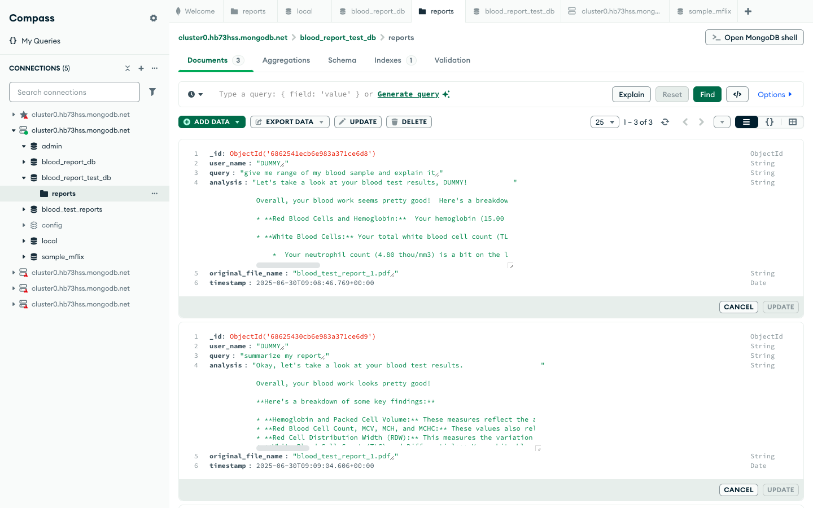
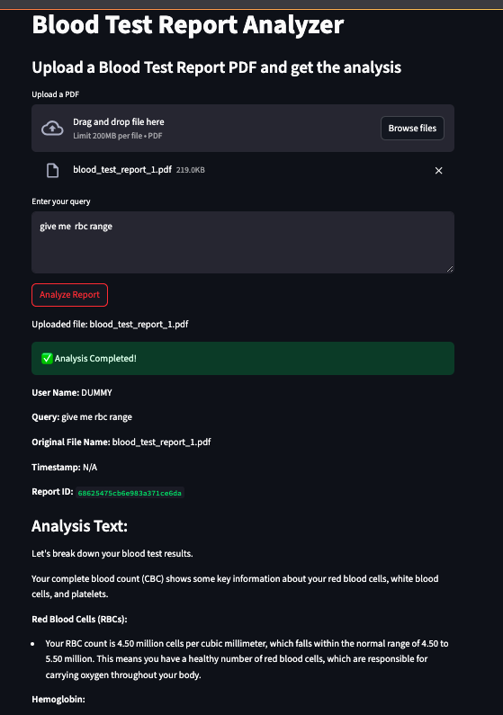

# ✅ Project Setup and Execution Guide
## 🔧 Project Installation

**1. Download & Extract Project**  
- Download the ZIP file from the provided link.  
- Extract into any folder.
**2. Python Version**  
Use **Python 3.10.x** (not 3.13): Some libraries in requirements.txt do not support Python 3.13.
This project has been tested and works with Python 3.10.x.
```bash
brew install python@3.10
```
**3. Create Virtual Environment**

```bash
python3.10 -m venv venv
source venv/bin/activate
```
**4. Install Dependencies**

```bash
pip install -r requirement.txt
```
**5. Create `.env` File**
```env
SERPER_API_KEY="your_serper_api_key_here"
GROQ_API_KEY="your_groq_api_key_here"
MONGO_URI="mongodb+srv://<username>:<password>@cluster0.mongodb.net/?retryWrites=true&w=majority&appName=Cluster0"
CELERY_BROKER_URL="redis://localhost:6379/0"
CELERY_RESULT_BACKEND="redis://localhost:6379/0"
```
---
## ✅ Summary of Bugs Fixed and Improvements

### ✅ **main.py**

| Issue                           | Solution                                             |
|---------------------------------|------------------------------------------------------|
| Blocking sync code in FastAPI   | Replaced with `run_crew_pipeline` for async safety   |
| No logging                      | Added Python logging                                 |
| Missing user name extraction    | Added PDF extraction for patient name               |
| No DB storage                    | Integrated MongoDB                                  |
| Poor error handling             | Added specific try/excepts and logs                  |
| Temp file cleanup issues        | Improved with safe deletion + logs                   |
---
### ✅ **agents.py**

| Issue                               | Solution                                              |
|-------------------------------------|-------------------------------------------------------|
| Comedy/fake agents                  | Created serious medical agents                        |
| Wrong attribute `tool=[]`           | Fixed to `tools=[]`                                   |
| Excessive token use with multiple agents | Disabled nutrition/exercise agents temporarily |
| No docs/comments                    | Added documentation                                   |

✅ **Active Agents:**

- Senior Doctor → Analyzes blood reports
- Verifier → Validates report type
---
### ✅ **task.py**

| Issue                        | Solution                                            |
|------------------------------|-----------------------------------------------------|
| Comedic/fake task logic      | Rewrote for real medical summaries                  |
| Unsafe recommendations       | Removed comedic or dangerous advice                |
| All tasks on Doctor agent    | Split tasks among specialized agents               |
| Repetitive task code         | Introduced `create_task` helper function            |

✅ New Features:

- Medical summaries
- Abnormal findings detection
- Celery support for background processing
---
### ✅ **tools.py**

| Issue                            | Solution                                                |
|----------------------------------|---------------------------------------------------------|
| Mixed sync/async tools           | Standardized with `BaseTool` pattern                    |
| Missing PDF loader               | Replaced with `PDFPlumberLoader`                        |
| Missing EnvVar patch             | Added CrewAI patch                                      |
| Dummy logic                      | Added placeholders + TODO comments                      |
| Double newlines in text          | Added text cleaning                                     |
| Token overflow from large PDFs   | Truncate to safe character limit (~3000)                |

✅ New Tools:

- **BloodTestReportTool** → Extracts text from PDFs
- **SerperDevTool** → Placeholder for web search
- **NutritionTool/ExerciseTool** → Structured but disabled until future work
---
### ✅ **crew_pipeline.py** (New File)

| Purpose                           | Details                                               |
|-----------------------------------|-------------------------------------------------------|
| Centralizes CrewAI orchestration  | Clean, reusable function for running CrewAI           |
| Handles PDF reading, tasks, agent calls | Keeps FastAPI routes clean                    |
| Improves error handling           | Logs all pipeline exceptions                          |
---
### ✅ **celery_config.py** (New File)---Bonus task

| Purpose                       | Details                                             |
|-------------------------------|-----------------------------------------------------|
| Handles background processing | Keeps FastAPI non-blocking                          |
| Redis as broker and result backend | Default config                                 |
| Easily extendable for heavy workloads | Add workers as needed                      |
---

### ✅ MongoDB Integration---Bonus Task
✅ **Saves:**

- user_name
- query
- analysis
- original_file_name
- timestamp
✅ **Benefits:**
- Auditing & traceability
- Search previous reports
- Ready for dashboards
---

## ✅ How to Run the Project

### Start FastAPI

```bash
uvicorn main:app --reload
```

Visit API docs:

```
http://127.0.0.1:8000/docs
```

---

### Start Celery Worker

In a new terminal:

```bash
celery -A Blood_Test_Analysis.celery_config.celery_app worker --loglevel=info
```
---
## ✅ How to Use the API

### Option 1 – cURL
```bash
curl -X POST "http://127.0.0.1:8000/analyze" \
  -F "file=@path/to/your/blood_test_report.pdf" \
  -F "query="YOUR_QUERY"
```
✅ Example Response:

```json
{
  "status": "success",
  "user_name": "NAME",
  "query": "YOUR_QUERY",
  "analysis": "...",
  "file_processed": "...",
  "report_id": "..."
}
```
---
### Option 2 – Streamlit Frontend
Run:
```bash
streamlit run path/to/your/streamlit_script.py
```
Then visit:
```
http://localhost:8501
```
✅ Upload PDF → Enter Query → See Results
## ✅ Benefits of Each Approach

| Method       | Best For                           |
|--------------|-------------------------------------|
| **cURL**     | Quick testing & automation         |
| **Streamlit**| Easy UI for non-developers         |

✅ **That’s it!** System is ready for reliable, professional blood test analysis.

## ✅ Sample Outputs

### MongoDB Output


---
### Streamlit Output


